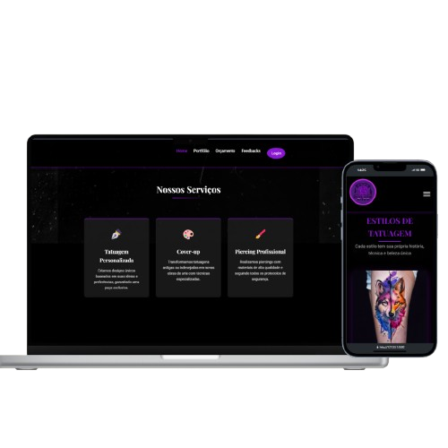
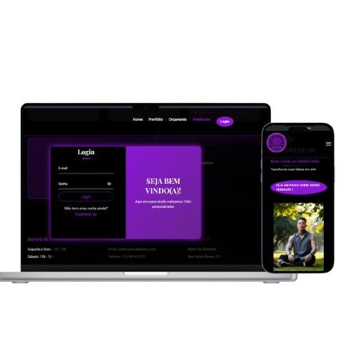

# 🖌️ Projeto TattoStudio

# 🧑🏽‍💻 Autor

 - ### Leonardo Cassiano 🧑🏽‍💻

## 📸 IMAGENS DO PROJETO





## 📽️ VIDEO DEMONSTRATIVO DO PROJETO FUNCIONANDO.

https://github.com/user-attachments/assets/bfa45961-9a6e-414f-bcc2-d9f977562875

---

## 🚀 Contribuindo para o Projeto

Ei, pessoal! 👋  
Esse repositório é nosso espaço para colaborar e desenvolver o projeto.  
Vamos trabalhar juntos para deixar o código o mais limpo e funcional possível.  

Aqui estão algumas orientações para garantir que a gente esteja sempre alinhado e que o projeto funcione direitinho.

---

## 🧭 Como Contribuir

### 1. 📥 Clonando o Repositório

```bash
git clone https://github.com/yLeonardoDev/TattoStudio.git nome_da_pasta
```

### 2. 📂 Acessar a Pasta do Repositório

```bash
cd nome_da_pasta
```

---

## 🛠️ Fazendo as Alterações

Agora é hora de meter a mão no código.  
Adicione as mudanças que você precisa fazer, sempre respeitando o escopo do projeto e evitando mexer onde não deve.

---

## 💾 Commitando e Enviando suas Alterações

### Adicionar as Alterações:

```bash
git add .
```

### Criar um Commit:

```bash
git commit -m "Descrição das mudanças feitas"
```

### Enviar para o Repositório:

```bash
git push origin main
```

---

## ⚠️ IMPORTANTE!!

Antes de subir qualquer coisa:

- Sempre revise suas alterações.  
- Teste se nada foi quebrado.  
- Se tiver dúvidas, pergunte antes de commitar.

A ideia é manter o projeto funcionando de forma estável, sem surpresas no código.

---

## 🏗️ ESTRUTURA DO PROJETO

```
├── 📁 backend
│   └── 📁 php
│       ├── 🐘 atualizar_email_processa.php
│       ├── 🐘 atualizar_senha_processa.php
│       ├── 🐘 cadastro.php
│       ├── 🐘 conecta.php
│       ├── 🐘 deletar_conta_processa.php
│       └── 🐘 login.php
├── 📁 public
│   ├── 📁 assets
│   │   ├── 📁 css
│   │   │   └── 🎨 style.css
│   │   ├── 📁 images
│   │   │   ├── 🖼️ Fundo-Black.webp
│   │   │   ├── 🖼️ Fundo-Black2.webp
│   │   │   ├── 🖼️ Fundo-Black3.webp
│   │   │   ├── 🖼️ Fundo-Black4.webp
│   │   │   ├── 🎬 Video_Explicacao-do-Projeto.mp4
│   │   │   ├── 🖼️ espaço.png
│   │   │   ├── 🖼️ favicon.png
│   │   │   ├── 🖼️ image.png
│   │   │   ├── 🖼️ instagram-icon.png
│   │   │   ├── 🖼️ logo.png
│   │   │   ├── 🖼️ mokup-1.png
│   │   │   ├── 🖼️ mokup-2.png
│   │   │   ├── 🖼️ tatuador.png
│   │   │   ├── 🎬 video.mp4
│   │   │   └── 🖼️ whatsapp-icon.png
│   │   └── 📁 js
│   │       └── 📄 script.js
│   ├── 🌐 avaliações.html
│   ├── 🌐 index.html
│   ├── 🌐 orçamentoCliente.html
│   └── 🌐 portfolio.html
├── 📄 LICENSE
└── 📝 README.md
```

## TABELA SQL 
```
I. Criar o banco de dados chamado "Conexao".

II. Criar a tabela, entre em SQL e cóla o código da Tabela.

• CÓDIGOS ABAIXO; 

CREATE DATABASE conexao;

CREATE TABLE usuarios (
    id INT AUTO_INCREMENT PRIMARY KEY,
    nome VARCHAR(255) NOT NULL,
    email VARCHAR(255) UNIQUE NOT NULL,
    cpf VARCHAR(20) UNIQUE NOT NULL,
    senha VARCHAR(255) NOT NULL,
    created_at TIMESTAMP DEFAULT CURRENT_TIMESTAMP
);

```
